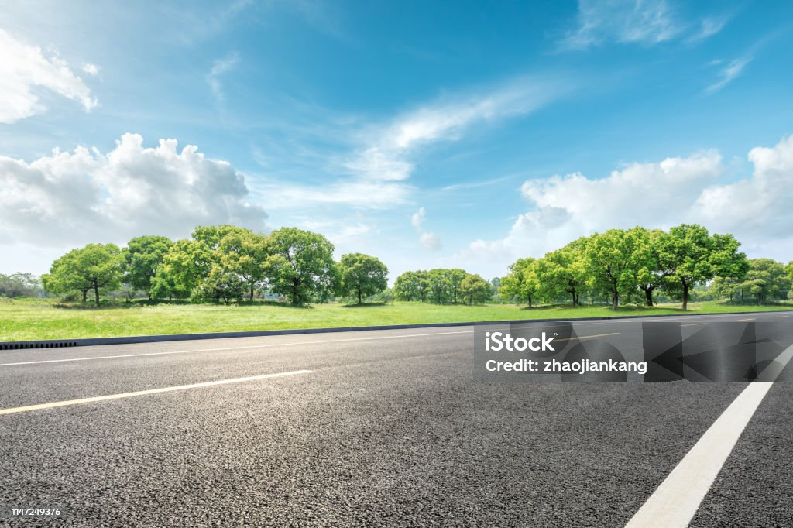

<body style="overflow-x:hidden;">

      

        <button type="button" data-bs-target="#carouselExampleDark" data-bs-slide-to="0" class="active" aria-current="true" aria-label="Slide 1"></button>
        <button type="button" data-bs-target="#carouselExampleDark" data-bs-slide-to="1" aria-label="Slide 2"></button>
        <button type="button" data-bs-target="#carouselExampleDark" data-bs-slide-to="2" aria-label="Slide 3"></button>
      

      

        

          
          

            <h5>First slide label</h5>
            
Some representative placeholder content for the first slide.

          

        

        

          
          

            <h5>Second slide label</h5>
            
Some representative placeholder content for the second slide.

          

        

        

          
          

            <h5>Third slide label</h5>
            
Some representative placeholder content for the third slide.

          

        

      

      <button class="carousel-control-prev" type="button" data-bs-target="#carouselExampleDark" data-bs-slide="prev">
        
        
      </button>
      <button class="carousel-control-next" type="button" data-bs-target="#carouselExampleDark" data-bs-slide="next">
        
        
      </button>
    

   Welcome to Marine Aero- & Hydrodynamics Laboratory led by <a href="/pi/">Dr. Asim Önder</a> at <a href="https://maev.nsysu.edu.tw/?Lang=en">Department of Marine Environment and Engineering</a> of <a href="https://www.nsysu.edu.tw/">National Sun Yat-sen University</a>. The lab pursues innovative fluid mechanics and CFD research to solve geophysical and engineering problems involving complex multi-phase, multi-scale flows in the marine environment.

The current research interests include:
- <b> Air-sea interactions</b>: wind-wave interactions, Langmuir circulations, gas and heat exchange
- <b> Offshore wind energy </b>: metocean characterization, aero-hydro coupling, atmospheric-stability effects, land-sea transition
- <b> Tsunamis </b>: bottom friction, sediment transport
- <b> Oceanic/atmospheric turbulence</b>: large-eddy simulation of near-surface layers, Reynolds-stress modelling, non-equilibrium turbulence
- <b> Computational science </b>: machine-learning models for interfacial flows, adjoint methods, immersed boundary methods, adaptive methods
   

